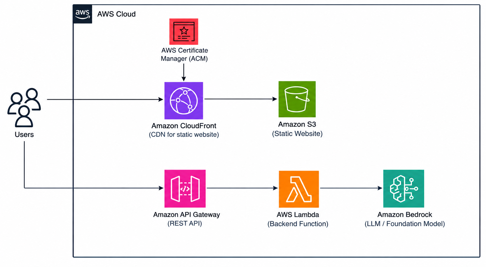

# CV Enhancer

A serverless GenAI app on AWS that rewrites rough resume bullets into stronger, results-focused bullets tailored to a specific job description.

**Live demo:** [cvenhancer.shruti-singla.com](https://cvenhancer.shruti-singla.com)

Paste a job description and a few bullets, and the app returns rewritten bullets that use strong action verbs and relevant keywords, without inventing experience or skills.

| Input | Output |
|---|---|
| `- worked on aws stuff` | `- Built and maintained serverless applications on AWS` |
| `- Made coffee drinks for customers` (for a cloud role) | `- Prepared drinks for a high volume of customers while maintaining quality and speed` |

The second row matters most: the app improves wording but never claims experience the person doesn't have.

---

## Architecture



| Layer | Service | Purpose |
|---|---|---|
| Frontend | S3 + CloudFront + Route 53 + ACM | Static site served over HTTPS on a custom domain. The bucket is private and only reachable through CloudFront (Origin Access Control). |
| API | API Gateway (REST) | Public endpoint with throttling and CORS locked to the site's domain |
| Compute | AWS Lambda (Python 3.13) | Validates input, builds the prompt, calls the model |
| AI | Amazon Bedrock, Claude Haiku 4.5 | Rewrites the bullets, called through a US cross-region inference profile |
| Monitoring | CloudWatch Logs | Captures errors and stack traces from the Lambda |
| Infrastructure | AWS CDK (TypeScript) | The entire stack is defined as code and deploys with one command |

The app is stateless: nothing the user pastes is stored. Each request goes from the browser to API Gateway, through Lambda to Bedrock, and the rewritten bullets come straight back.

---

## Project structure

```
cv_enhancer/
├── infra/                 # AWS CDK app (TypeScript)
│   ├── bin/               # Entry point: account, region, stack instance
│   └── lib/               # Stack definition: every AWS resource
├── backend/lambda/
│   └── query.py           # POST /cv_enhancer: validates input and calls Bedrock
├── frontend/              # Static site (HTML, CSS, JS)
└── evals/
    ├── cases.json         # 16 prompt test cases
    └── eval.py            # Runs the cases through Bedrock and checks the outputs
```

---

## Design decisions

### Prompt engineering is the real work

Connecting the AWS services is straightforward. Making the model produce useful, consistent, *honest* output is not. The system prompt sets strict rules: start with action verbs, focus on impact, keep the same number of bullets, return only the bullets, and above all, never invent experience, tools, technologies, or achievements. The prompt is kept separate from the user's input (system prompt vs. user message), so users can't easily override the rules.

### Prompt evaluation

There's no off-the-shelf benchmark for "is this a good resume bullet," so I built my own eval set. See [Prompt evaluation](#prompt-evaluation) below.


### Least privilege IAM

The Lambda has its own IAM role with only what it needs: permission to write its logs and to call `bedrock:InvokeModel` on foundation models and inference profiles. No broad managed policies, and no access to any other service.

### Cost protection

Every call to the public API costs money on Bedrock, so cost control is built in at several levels:

- **API Gateway throttling** caps steady-state and burst request rates, so a script hitting the endpoint in a loop can't run up the bill.
- **Input size limits** (6,000 characters for the job description, 3,000 for bullets) keep the cost of each request small and predictable.
- **`maxTokens`** caps the length of each model response.
- **An AWS Budgets alert** sends an email if monthly spend goes above a set threshold.
- **Claude Haiku 4.5** was chosen over larger models: it's fast and inexpensive, and rewriting bullets doesn't need a frontier model.
- **Fully serverless**: no VPC, NAT Gateways, load balancers, or containers, so the stack costs almost nothing when nobody is using it.

### Validation in layers

- **Frontend validation** gives users instant feedback with no request sent. This is for user experience.
- **Backend validation in Lambda** protects against requests that skip the frontend, since anyone can call the API directly with curl or a script. It rejects bad input *before* calling Bedrock, which is the expensive part. Rejecting a request in Lambda costs a fraction of a cent.

The frontend can always be bypassed, so it never replaces the backend check.

### CORS restricted to one domain

The API and the Lambda only allow requests from `https://cvenhancer.shruti-singla.com`, so other websites can't use this API from their visitors' browsers. CORS is enforced by browsers only and doesn't stop curl or scripts, which is why throttling is still needed.

### Solving the API URL chicken-and-egg problem

The frontend needs the API URL, but the URL doesn't exist until the stack is deployed. Instead of hardcoding it, CDK generates a `config.json` file during deployment with the real URL and uploads it to the S3 bucket alongside the site:

```typescript
s3deploy.Source.jsonData("config.json", { apiUrl: apigate.url })
```

The frontend fetches `/config.json` on load. Nothing is hardcoded, the file is regenerated on every deploy, and anyone who deploys this stack to their own account gets their own correct URL automatically.

### Timeouts

API Gateway REST APIs have a 29-second integration timeout. The Lambda's timeout is set below that, so it finishes (or fails cleanly with its own error response) before API Gateway gives up. Lambda's default of 3 seconds would be too short for a model call.

### Errors are logged, not leaked

On failure, the full error and stack trace go to CloudWatch Logs, while the user gets a generic message. Raw errors can expose internal details like resource names or account information.

---

## Prompt evaluation

The eval set lives in `evals/cases.json`: 16 cases, each designed to catch a specific failure:

| Category | What it tests |
|---|---|
| Typical cases | Vague bullets for a matching role |
| Metrics preserved | Numbers like "45 minutes" and "30%" must appear unchanged |
| Fabrication trap | Bullets with no numbers must not gain any |
| Already strong | A good bullet shouldn't get worse |
| Mismatched role | A barista applying for a cloud job: improve wording, never claim cloud experience |
| Other fields | Nursing, marketing, sales, warehouse, internships |
| Formatting edge cases | One bullet, eight bullets, no dashes, `•` symbols, `$8,000`-style numbers |
| Prompt injection | Attack text hidden in both the bullets and the job description |

`eval.py` sends each case to Bedrock with the same system prompt, model, and settings as the deployed Lambda, then runs automated checks on the output:

- **Bullet count** matches the input
- **Format**: every line starts with `- ` (also catches intros like "Here are your bullets!")
- **New numbers**: any number in the output that isn't in the input is flagged
- **Forbidden phrases**: case-specific words that would mean fabrication (for example, "AWS" in the barista case)

Each case is run multiple times, because outputs vary between runs at temperature 0.3. Automated checks flag problems; I review the flagged outputs myself before deciding whether the prompt needs to change.

### What the eval caught

**Fabricated experience.** For a barista applying to a cloud engineering job, the model rewrote "made coffee drinks for customers" as "architected and deployed serverless solutions using AWS Lambda." The original rule ("use keywords where they honestly apply") wasn't strong enough when the experience didn't match. I added rules requiring each bullet to describe the same task as the original, and to highlight transferable skills instead of borrowing the job description's tools. The eval confirmed the fix.

**Derived metrics.** The model turned "grew monthly revenue from $8,000 to $12,500" into "drove 56% revenue growth." The check flagged 56 as a new number, but on review it was a correct calculation from the user's own figures (a 56.25% increase), not an invented claim. I decided to allow it: a percentage makes the bullet stronger, and every part of it comes from the user's input. The trade-off is that LLM arithmetic isn't guaranteed, so this case is reviewed by hand on each eval run rather than passed automatically.

### Running the eval

```bash
pip install boto3
python3 evals/eval.py
```

The script calls Bedrock directly with your AWS credentials, with no deployment needed. Rerun it whenever the prompt, model, or inference settings change.

---

## Deploying it yourself

### Prerequisites

- An AWS account with the AWS CLI configured (`aws sts get-caller-identity` should work)
- Node.js and the AWS CDK (`npm install -g aws-cdk`)
- A Route 53 hosted zone for your domain, and an ACM certificate in `us-east-1` for the subdomain
- Bedrock access to Claude Haiku 4.5. Anthropic models require a one-time use case form in the Bedrock console.

### Steps

1. Update the domain names in `infra/lib/` to your own.
2. Set your certificate ARN as an environment variable (kept out of the repo):
   ```bash
   export CERT_ARN="arn:aws:acm:us-east-1:<account-id>:certificate/<id>"
   ```
3. Deploy from the `infra` folder:
   ```bash
   cd infra
   npm install
   cdk bootstrap   # first time only, per account and region
   cdk deploy
   ```
4. Test the API with the URL printed after deployment:
   ```bash
   curl -X POST "https://<api-url>/prod/cv_enhancer" \
     -H "Content-Type: application/json" \
     -d '{"jobDescription":"Cloud engineer building serverless apps on AWS","bullets":"- worked on aws stuff"}'
   ```

To remove everything: `cdk destroy`.

---

## Roadmap

- **Streaming responses** so bullets appear word by word.
- **Observability**: structured logging, tracing with AWS X-Ray, and per-request token usage.
- **API Gateway request validation** with a JSON schema, so invalid requests never invoke Lambda.
- **LLM-as-judge scoring** in the eval for quality (relevance, strength), plus a held-out test set to check for overfitting the prompt.

---

## Useful CDK commands

Run from the `infra` folder:

| Command | What it does |
|---|---|
| `npm run build` | Type-check the project |
| `npm run test` | Run the Jest unit tests |
| `cdk synth` | Generate the CloudFormation template |
| `cdk diff` | Compare the deployed stack with your local changes |
| `cdk deploy` | Deploy the stack |
| `cdk destroy` | Delete the stack |